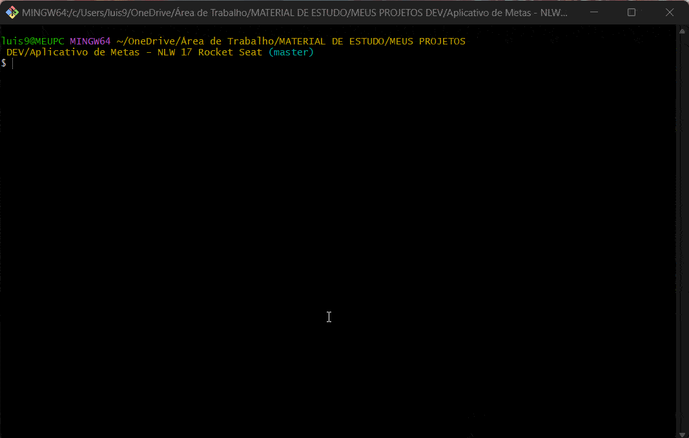

<h1 align="center">Gerenciador de Metas</h1>

Projeto realizado na NLW17 da @Rocketseat.

  <a href="#-tecnologias">Tecnologias</a>&nbsp;&nbsp;&nbsp;|&nbsp;&nbsp;&nbsp;
  <a href="#-projeto">Projeto</a>&nbsp;&nbsp;&nbsp;|&nbsp;&nbsp;&nbsp;
  <a href="#-layout">Experiência Adquirida</a>&nbsp;&nbsp;&nbsp;|&nbsp;&nbsp;&nbsp;

## 🚀 Tecnologias

Esse Projeto foi desenvolvido com as seguintes tecnologias:

- Javascript
- Node.js

## 💻 Projeto

Este é um aplicativo para gerenciamento de metas, nele você pode estipular metas do dia a dia e organizar suas metas da forma que desejar.

## 🧠 Experiência Adquirida
Esse foi um projeto muito enriquecedor para meus conhecimentos com Javascript. Tive a oportunidade de fazer uso do Node.js e também entender um pouco mais sobre o uso de JSON e também das funções assíncronas. Estou feliz com o resultado e também em obter mais conhecimentos e estar avançando como Dev!